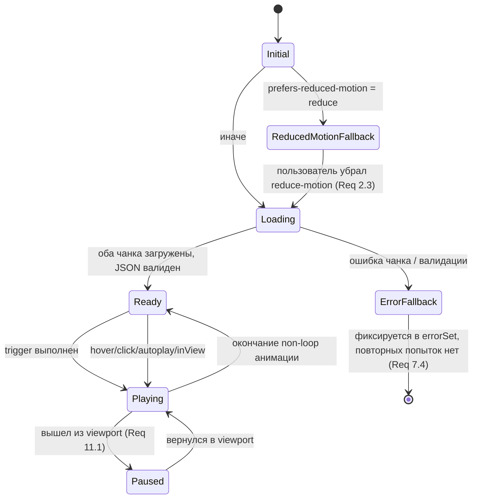

# Design Document

## Overview

Документ описывает архитектуру внедрения Lottie-анимаций в UniTest_Client. Ключевые цели:

1. Один переиспользуемый компонент `LottieIcon`, изолирующий все детали Lottie_Runtime от вызывающего кода.
2. Жёсткий контроль размера Initial_Bundle (+≤10 КБ gzip): Lottie_Runtime и Asset_Chunks выносятся в отдельные асинхронные чанки Vite.
3. Уважение к `prefers-reduced-motion` и доступность по умолчанию (никаких лишних `aria-*`-шумов, корректные `role="img"` и фокусируемость для кликабельных иконок).
4. Отказоустойчивость: при любой ошибке загрузки или валидации показывается статичная иконка `lucide-react`, вместо того чтобы уронить всё дерево.
5. Сосуществование с `AnimatedFlame`, `AnimatedIcon`, `AnimatedHero` без миграций в первой итерации (Requirement 8).
6. Точечная интеграция в пять мест UI (NotificationBell, PublicAchievementsTab, лоадер, пустые состояния, отправка теста, реакции в чате), очерченных Requirement 9.

### Решение по Lottie_Runtime

Рассмотрены три варианта:

| Кандидат | Что внутри | Размер (≈ minified / gzip) | Плюсы | Минусы |
|---|---|---|---|---|
| `lottie-web` (полная) | SVG/Canvas/HTML рендереры + expressions | ~237 KB / ~70 KB | Максимально совместимая, эталон формата | Слишком тяжёлая под наши задачи (мелкие иконки) |
| `lottie-web/build/player/lottie_light` | Только SVG-рендерер, без expressions/effects | ~70 KB / ~25–28 KB | В 2–3 раза легче, покрывает 99% UI-иконок | Не поддерживает expressions/эффекты (нам не нужны) |
| `@lottiefiles/dotlottie-web` (+ `dotlottie-react`) | WASM-плеер LottieFiles, нативная поддержка `.lottie` ZIP | ~150–200 KB JS + ~400 KB WASM | Меньшие ассеты `.lottie`, единый формат | Тяжёлый рантайм, WASM грузится отдельно, бьёт цель в +10 КБ gzip; избыточно для одиночных мелких иконок |
| `lottie-react` | React-обёртка над `lottie-web` (полным) | ~75 KB gzip | Готовый React API | Тянет полный `lottie-web`, не позволяет подменить на light-сборку без хаков |

**Выбор: `lottie-web` (light SVG renderer) + собственный тонкий React-хук `useLottieAnimation`.**

Обоснование:
- Light-сборка покрывает все UI-задачи (колокольчик, трофей, лоадер, эмодзи-реакции, иллюстрации пустых состояний). Expressions/effects в наших ассетах запрещены на этапе ревью (см. Asset_Registry — раздел «Контракт ассета»).
- Ручной импорт `lottie-web/build/player/lottie_light` гарантирует, что Vite/Rollup не подтянет полный пакет «по дороге» через side-эффекты.
- Собственный хук в ~50 строк кода дешевле, чем зависимость `lottie-react` (~10 KB gzip сверху) и не тащит полную сборку.
- Формат ассетов в первой итерации — `.json` (Bodymovin). Поддержка `.lottie` (ZIP) опционально включается отдельным микро-загрузчиком (распаковка `fflate` или браузерный `DecompressionStream`), но не входит в этот спринт; реестр спроектирован так, чтобы добавить её без изменений компонента.

Альтернатива на будущее: если суммарный объём ассетов превысит ~200 KB или появятся пресеты с эффектами, рассмотреть переход на `@lottiefiles/dotlottie-web` целиком.

## Architecture

```mermaid
flowchart LR
  subgraph Eager["Initial_Bundle (eager)"]
    A[LottieIcon.jsx]
    R[lottieRegistry.js]
    F[fallbackMap.js]
  end

  subgraph LazyRuntime["Lottie_Chunk (lazy)"]
    P[LottiePlayer.jsx]
    L[lottie-web/build/player/lottie_light]
    H[useLottieAnimation hook]
    O[applyColorOverride.js]
  end

  subgraph LazyAssets["Asset_Chunks (lazy, по одному на ассет)"]
    J1[(bell.json)]
    J2[(trophy.json)]
    J3[(loader.json)]
    Jn[(...)]
  end

  Caller[Вызывающий компонент<br/>NotificationBell / PublicAchievementsTab / ...] -->|name="bell"| A
  A -->|reduced-motion?| FB[Static_Fallback_Icon<br/>lucide-react]
  A -->|ok| P
  A --> R
  R -->|import('./assets/lottie/bell.json')| J1
  P --> L
  P --> H
  H --> O
  P -->|onError| FB
  J1 -->|JSON data| P
```

### Поток выполнения при первом монтировании `<LottieIcon name="bell" />`

1. Eager-код `LottieIcon` исполняется немедленно (он крошечный, ~3 KB gzip).
2. Проверяется `prefers-reduced-motion`. Если включено — рендерится Static_Fallback_Icon из `fallbackMap[name]`, ни один Asset_Chunk и ни один Lottie_Chunk не загружается (Requirement 2.1, 2.2, 3.1).
3. Иначе `LottieIcon` через `React.lazy` подключает `LottiePlayer`. Vite вычленяет это в отдельный Lottie_Chunk (Requirement 3.1).
4. Параллельно `LottieIcon` вызывает `lottieRegistry.load('bell')` — это `() => import('../assets/lottie/bell.json')`. Vite превращает каждый такой импорт в отдельный Asset_Chunk (Requirement 3.3).
5. Внутри `<Suspense>` отображается невидимый плейсхолдер размера `size×size` (предотвращает CLS).
6. Когда оба чанка загружены, `LottiePlayer` инициализирует `lottie.loadAnimation(...)`, при необходимости применяет `colorOverride` и стартует согласно `trigger`.
7. При размонтировании вызывается `animation.destroy()` синхронно в `useEffect` cleanup (Requirement 11.2).

### Поток при повторных монтированиях

- Lottie_Chunk и Asset_Chunk уже в HTTP-кэше браузера — браузер переиспользует их без сетевого запроса (Requirement 3.5). На уровне приложения мы дополнительно мемоизируем уже разобранный JSON в `Map<name, animationData>` модульного скоупа, чтобы повторно избежать `JSON.parse` на больших ассетах.

### Стратегия code-splitting в Vite

Vite/Rollup автоматически создаёт отдельный чанк для динамического импорта. Не требуется ручная конфигурация `manualChunks`. Условия:

- `LottiePlayer` подключается через `const LottiePlayer = lazy(() => import('./LottiePlayer.jsx'))`.
- Внутри `LottiePlayer` импорт рантайма: `import('lottie-web/build/player/lottie_light')`. Используется именно динамический импорт, чтобы ни один статический путь от `client/src/main.jsx` не доходил до `lottie-web` (это и есть гарантия отсутствия его в Initial_Bundle).
- Каждый ассет: `() => import(/* @vite-ignore */ ...)` — нет, в реестре пути литеральны: `() => import('../assets/lottie/bell.json')`. Vite разрешит эти импорты на этапе сборки, превратит каждый в отдельный URL и обеспечит корректный hash.
- Для контроля размера будет добавлена проверка в CI (отдельная задача в `tasks.md`): после `vite build` парсится `client/dist/assets/*.js`, считается gzip-разница против baseline. Порог: +10 КБ gzip, иначе сборка падает.

### Уровни изоляции

```
LottieIcon (eager wrapper)
  └─ LottieErrorBoundary (eager, ~0.5 KB)
       └─ Suspense
            └─ LottiePlayer (lazy)
                 ├─ useLottieAnimation
                 ├─ applyColorOverride
                 ├─ useInView (для trigger="inView" и off-screen pause)
                 └─ useReducedMotionLive (живая подписка на matchMedia)
```

`LottieErrorBoundary` — на уровне обёртки, чтобы поймать как ошибку загрузки чанка (Requirement 7.1, 7.2), так и runtime-ошибки рантайма.

## Components and Interfaces

### `LottieIcon` (публичный API)

```ts
type LucideIcon = (props: { size?: number; className?: string }) => JSX.Element;

type ColorOverride = Record<string, string>; // { "#7c3aed": "#f97316", "rgb(0,0,0)": "#ffffff" }

type Trigger = 'autoplay' | 'hover' | 'click' | 'inView';

interface LottieIconProps {
  name: string;                  // ключ из Asset_Registry (Req 1.1)
  size?: number;                 // px, default 24 (Req 1.2)
  className?: string;            // на корневой элемент (Req 1.3)
  loop?: boolean;                // default зависит от trigger (Req 1.4, 1.5)
  autoplay?: boolean;            // default true для trigger="autoplay" (Req 1.6)
  trigger?: Trigger;             // default "autoplay" (Req 1.7–1.9)
  speed?: number;                // > 0, default 1 (Req 1.10)
  colorOverride?: ColorOverride; // Req 5.1–5.4
  ariaLabel?: string;            // Req 6.1, 6.2
  onClick?: (e: React.MouseEvent | React.KeyboardEvent) => void;
  fallbackIcon?: LucideIcon;     // Req 2.4
}
```

Дефолтные `loop`/`autoplay` по `trigger`:

| trigger | loop default | autoplay default |
|---|---|---|
| `autoplay` | `false` | `true` |
| `hover` | `false` | `false` |
| `click` | `false` | `false` |
| `inView` | `false` | `false` (запуск по пересечению) |

Эти умолчания — общая семантика «иконка играет один раз, если явно не указан loop». Для индикатора загрузки и иллюстрации пустого состояния (Req 9.3, 9.4) вызывающий код ставит `loop` явно.

### `LottiePlayer` (внутренний, ленивый)

Изолирует всю работу с `lottie-web`. Получает все props от `LottieIcon` плюс уже разрешённый `animationData: object`. Возвращает `<div>` с актуальными ARIA-атрибутами (см. ниже).

Контракт:

```ts
interface LottiePlayerProps extends LottieIconProps {
  animationData: object;      // уже импортированный JSON
  fallback: LucideIcon;       // выбранный Static_Fallback_Icon
  // прочие props пробрасываются от LottieIcon
}
```

### `lottieRegistry`

```ts
// client/src/assets/lottie/registry.js
type AssetLoader = () => Promise<{ default: object }>;

interface LottieRegistryEntry {
  loader: AssetLoader;
  fallback: LucideIcon;       // обязателен для каждого имени (Req 2.x, 7.x)
  // опциональная декларативная мета для линта дизайн-системы:
  defaultSize?: number;
  description?: string;
}

export const lottieRegistry: Record<string, LottieRegistryEntry>;
export type LottieIconName = keyof typeof lottieRegistry;
```

Пример (фрагмент):

```js
import { Bell, Trophy, Loader2, Inbox, CheckCircle2, Smile } from 'lucide-react';

export const lottieRegistry = {
  bell:           { loader: () => import('./bell.json'),           fallback: Bell },
  trophy:         { loader: () => import('./trophy.json'),         fallback: Trophy },
  loading:        { loader: () => import('./loading.json'),        fallback: Loader2 },
  empty:          { loader: () => import('./empty.json'),          fallback: Inbox },
  testSuccess:    { loader: () => import('./test-success.json'),   fallback: CheckCircle2 },
  reactionFire:   { loader: () => import('./reaction-fire.json'),  fallback: Smile },
  // ... добавляются по мере добавления ассета
};
```

Уникальность ключей обеспечивается самим объектным синтаксисом (дубль ключа в JS — синтаксическая «mute», но ESLint правило `no-dupe-keys` ловит это на этапе линта). Дополнительно — статический guard в сборке: при импорте `registry.js` вычисляется `assert(Object.keys(lottieRegistry).length === new Set(Object.keys(lottieRegistry)).size, ...)` (фактически redundant, но это обнаруживает гипотетический сценарий программной мутации). Vite-плагин (легковесный, в `vite.config.js`) проверяет, что:

1. Все ключи реестра имеют уникальное имя.
2. Каждый путь, на который ссылается реестр, существует физически.
3. Каждый зарегистрированный ассет упомянут в `CREDITS.md`.

При нарушении — `this.error(...)` в плагине, что роняет `vite build` (Requirement 4.5, 10.1).

### Хуки

#### `useReducedMotionLive(): boolean`

Живая подписка на `window.matchMedia('(prefers-reduced-motion: reduce)')` через `useSyncExternalStore`, чтобы реакция была в текущем цикле рендеринга React (Requirement 2.3):

```js
const QUERY = '(prefers-reduced-motion: reduce)';

function subscribe(cb) {
  const mql = window.matchMedia(QUERY);
  mql.addEventListener('change', cb);
  return () => mql.removeEventListener('change', cb);
}
function getSnapshot() {
  return window.matchMedia(QUERY).matches;
}
function getServerSnapshot() {
  return false;
}
export function useReducedMotionLive() {
  return useSyncExternalStore(subscribe, getSnapshot, getServerSnapshot);
}
```

#### `useInView(ref, { rootMargin })`

Тонкая обёртка над `IntersectionObserver`. Возвращает `boolean`. Используется:

- для `trigger="inView"` — стартует анимацию, когда элемент входит в видимую область (Requirement 1.9, 9.1, 9.2);
- внутри `LottiePlayer` всегда — для off-screen pause (Requirement 11.1). Т.е. даже при `trigger="autoplay"` или `loop=true` анимация ставится на паузу при выходе из viewport.

`rootMargin` по умолчанию `'0px'`. Один общий instance `IntersectionObserver` на компонент.

#### `useLottieAnimation({ container, animationData, loop, autoplay, speed, colorOverride })`

Управляет жизненным циклом одного экземпляра `lottie.loadAnimation`. Возвращает `{ play, stop, goToFirstFrame, isReady }`. Внутренние особенности:

- Создание происходит после клонирования `animationData` (`structuredClone`), чтобы Color_Override не мутировал общий кэшированный объект.
- При смене `colorOverride` — повторное применение трансформации через сравнение ссылочного `colorOverride` (по содержимому, через стабильный JSON-stringify). Анимация не пересоздаётся, а патчится в живых слоях (Requirement 5.2).
- При смене `speed` вызывается `animation.setSpeed(newSpeed)`.
- На unmount: `animation.destroy()` синхронно (Requirement 11.2).

### `applyColorOverride(animationData, mapping)`

Чистая функция (без побочных эффектов на исходный объект — работает с клоном). Алгоритм:

1. Нормализует ключи и значения `mapping` к нормализованной форме `[r, g, b]` в диапазоне `[0, 1]` (Lottie хранит цвета именно так — 4-членные кортежи, последнее значение alpha). Поддерживаемые входные формы (Requirement 5.3):
   - `#RRGGBB`
   - `rgb(R, G, B)` с R/G/B в `[0, 255]`.
2. Рекурсивно обходит структуру Lottie JSON: для каждого слоя `layers[i].shapes[*].it[*].c.k` (статический цвет) или `c.k = [...]` (анимированный) нормализует найденный цвет, сравнивает (с допуском по компонентам ≤ `1/255`) с ключами mapping и при совпадении подменяет.
3. Возвращает новый объект (immutable).
4. Возвращает также `meta.replacedKeys: string[]` — те ключи `mapping`, которые не были найдены ни на одном слое. В режиме `import.meta.env.DEV` эти ключи логируются через `console.warn` (Requirement 5.4). В production — молчание.

Поддерживаются только цвета. Другие типы (gradient stops) в первой итерации не трогаются.

### `LottieErrorBoundary`

```jsx
class LottieErrorBoundary extends React.Component {
  state = { failed: false };
  static getDerivedStateFromError() { return { failed: true }; }
  componentDidCatch(err) {
    if (import.meta.env.DEV) console.error('[LottieIcon] runtime error', err);
  }
  render() {
    if (this.state.failed) return this.props.fallback;
    return this.props.children;
  }
}
```

Срабатывает при:
- падении импорта Lottie_Chunk (Requirement 7.1) — `React.lazy` пробрасывает rejected promise через Suspense → ErrorBoundary;
- падении импорта Asset_Chunk внутри `LottiePlayer` — `await loader()` оборачивается в try/catch, при ошибке кидаем — попадаем в ErrorBoundary (Requirement 7.2);
- падении валидации Lottie JSON (минимальная санитарная проверка: наличие `v`, `fr`, `w`, `h`, `layers` массивом) — Requirement 7.3;
- любой runtime-ошибке `lottie.loadAnimation`.

После срабатывания ErrorBoundary запоминает в модульном `Set<string>` (по имени ассета) факт ошибки, и при последующих монтированиях того же `name` `LottieIcon` сразу рендерит fallback без попытки загрузки (Requirement 7.4).

### Доступность: вычисление ARIA

Алгоритм `computeAria(props)`:

```
if (props.ariaLabel && props.ariaLabel.trim() !== '') {
  → role="img", aria-label=props.ariaLabel.trim()
} else {
  → aria-hidden="true"
}

if (props.trigger === 'click' && typeof props.onClick === 'function') {
  → tabIndex=0, role="button" (вытесняет role="img" — иконка-кнопка важнее иконки-картинки)
  → onKeyDown: Enter / Space → e.preventDefault() + onClick(e)
}
```

Когда trigger=`'click'` и нет `ariaLabel`, выбрасываем `console.warn` в DEV (кликабельная иконка без подписи — это проблема доступности).

Мерцания: при ревью каждого ассета (см. CREDITS.md) проверяется отсутствие визуальных скачков яркости с частотой >3 Hz (Requirement 6.4). Это организационная мера; в коде нет автоматической проверки.

## Data Models

### Структура файлов

```
client/src/
├── components/
│   └── LottieIcon/
│       ├── index.js                  # реэкспорт LottieIcon
│       ├── LottieIcon.jsx            # eager-обёртка
│       ├── LottieErrorBoundary.jsx
│       ├── LottiePlayer.jsx          # lazy: React.lazy этот файл
│       ├── useLottieAnimation.js
│       ├── useReducedMotionLive.js
│       ├── useInView.js
│       ├── applyColorOverride.js
│       └── computeAria.js
└── assets/
    └── lottie/
        ├── registry.js               # Asset_Registry
        ├── CREDITS.md                # источники и лицензии
        ├── bell.json
        ├── trophy.json
        ├── loading.json
        ├── empty.json
        ├── test-success.json
        └── reaction-fire.json
```

### Контракт ассета (валидация перед добавлением)

Каждый JSON, попадающий в `client/src/assets/lottie/`, должен:

1. Соответствовать схеме Bodymovin v5+ (поля `v`, `fr`, `w`, `h`, `layers: any[]`).
2. Не содержать expressions (поле `ks.p.x` или любые другие `*.x` — выражения), так как Lottie_Light их не выполняет.
3. Не содержать ссылок на внешние ассеты (поле `assets[*].u` или `p` указывающее на URL) — все ассеты должны быть встроены или отсутствовать.
4. Иметь визуальный размер ≤ ~30 KB gzip как файл (мягкий порог, для UI-иконок).
5. Не содержать мерцания >3 Hz (организационное ревью, Requirement 6.4).
6. Иметь лицензию, разрешающую коммерческое использование (Requirement 10.2). Если лицензия требует обязательной атрибуции в UI — отклоняется (Requirement 10.3).

### Формат `CREDITS.md`

```markdown
# Lottie Animation Credits

Каждая запись описывает один файл в этом каталоге.

## bell.json
- **Source**: https://lottiefiles.com/animations/bell-xxxxx
- **Author**: <имя автора или ник>
- **License**: <SPDX-идентификатор, напр. CC0-1.0 / MIT / LottieFiles Free License>
- **Commercial use**: yes
- **UI attribution required**: no
- **Date added**: 2025-XX-XX
- **Notes**: модифицирован — изменена палитра под дизайн-систему

## trophy.json
- ...
```

Поля обязательные: Source, Author, License, Commercial use, UI attribution required, Date added. Vite-плагин из раздела «Asset_Registry» проверяет, что для каждого `*.json` в каталоге есть запись с тем же именем в `CREDITS.md` и `UI attribution required: no`.

### Состояния `LottieIcon` (state machine)



### Точки интеграции (UI mapping)

| Где | Что | Props |
|---|---|---|
| `client/src/components/NotificationBell.jsx` (button иконка `Bell` size=16) | Lottie-колокольчик при появлении нового уведомления | `name="bell"`, `trigger="inView"`, `loop=false`, `size=16`, `ariaLabel={t('notifications')}` |
| `client/src/components/profile/settings/public/PublicAchievementsTab.jsx` (заголовок + каждая разблокированная ачивка) | Lottie-трофей один раз | `name="trophy"`, `trigger="inView"`, `loop=false`, `size=22` |
| Существующие spinners (`Loader2`, `animate-spin div`) — сохраняются. Новый компонент `<LoadingIndicator />` (создаётся в этом спринте, использует `LottieIcon`) применяется в местах верхнего уровня страниц | Lottie-индикатор загрузки | `name="loading"`, `trigger="autoplay"`, `loop=true`, `size=48`, `ariaLabel="Loading"` |
| Пустые состояния (тесты, группы, сообщения) — заворачиваются в новый `<EmptyState illustration="empty" caption="..." />` | Lottie-иллюстрация | `name="empty"`, `trigger="autoplay"`, `loop=true`, `size=120` |
| Финал отправки теста (`TakeTest.jsx` — экран после успешного submit) | Анимация подтверждения | `name="testSuccess"`, `trigger="autoplay"`, `loop=false`, `size=72`, `ariaLabel="Тест отправлен"` |
| Reaction picker в `MessageBubble.jsx` (для каждого emoji в `QUICK_REACTIONS`, в первой итерации — только `🔥` как «горячая» реакция, остальные остаются эмодзи) | Lottie-эмодзи на hover | `name="reactionFire"`, `trigger="hover"`, `loop=false`, `size=24` |

`AnimatedFlame`, `AnimatedIcon`, `AnimatedHero` остаются неизменными (Requirement 8.1, 8.4). Стрик-иконка по-прежнему рендерится через `AnimatedFlame` с её raster/video pipeline (Requirement 8.3).


## Correctness Properties

*Свойство (property) — это утверждение, которое должно выполняться для всех допустимых исполнений системы. Свойства образуют мост между человекочитаемой спецификацией и автоматически проверяемыми гарантиями корректности. В отличие от unit-теста с фиксированным примером, property-test проверяет утверждение на множестве сгенерированных входов.*

### Property 1: Visual size invariant

*Для любого* положительного целого `size ∈ [1, 512]` и любого зарегистрированного имени `name`, после монтирования `<LottieIcon name={name} size={size} />` ширина и высота корневого DOM-элемента в пикселях равны `size`, независимо от того, отображается ли реальная анимация или Static_Fallback_Icon.

**Validates: Requirements 1.2**

### Property 2: ClassName preservation

*Для любой* строки `className`, состоящей из CSS-валидных токенов разделённых пробелами, после монтирования `<LottieIcon className={className} ... />` каждый токен присутствует в `classList` корневого DOM-элемента, и ни один существующий токен компонента не вытесняется.

**Validates: Requirements 1.3**

### Property 3: Trigger defaults consistency

*Для любой* комбинации `(trigger, loop, autoplay)` валидных значений props, аргументы, переданные в `lottie.loadAnimation`, и initial dispatch (`play` либо `goToAndStop(0)`) совпадают со спецификацией умолчаний из таблицы дефолтов раздела «Components and Interfaces».

**Validates: Requirements 1.4, 1.5, 1.6**

### Property 4: Trigger state machine

*Для любого* `trigger ∈ {hover, click, inView}` и любой конечной последовательности соответствующих DOM-событий (`mouseenter`/`mouseleave`, `click`, или viewport-`enter`/`exit`), результирующее состояние компонента после последнего события совпадает с табличным определением: для `hover` — играет тогда и только тогда, когда последнее событие — enter; для `click` — играет один раз после каждого click; для `inView` — играет тогда и только тогда, когда элемент находится внутри viewport. Дополнительно, при выходе из viewport анимация вне зависимости от триггера ставится на паузу.

**Validates: Requirements 1.7, 1.8, 1.9, 11.1**

### Property 5: Speed propagation

*Для любого* `speed ∈ (0, 100]`, после монтирования `<LottieIcon speed={speed} ... />` метод `animation.setSpeed(speed)` вызывается ровно один раз с этим значением. При последующем изменении props.speed на новое валидное значение `speed'`, `setSpeed(speed')` вызывается снова без пересоздания экземпляра анимации.

**Validates: Requirements 1.10**

### Property 6: Multiple instances independence

*Для любого* `n ∈ [1, 20]` и любого набора имён `[name_1, ..., name_n]`, после одновременного монтирования `n` экземпляров `LottieIcon`, метод `lottie.loadAnimation` вызывается ровно `n` раз и каждый экземпляр получает собственный объект анимации (отдельные `currentFrame`, `play`, `destroy` ссылки).

**Validates: Requirements 1.11**

### Property 7: Reduce-motion shortcut

*Для любых* валидных props и зарегистрированного `name`, при `matchMedia('(prefers-reduced-motion: reduce)').matches === true` выполняются одновременно: (a) корневой DOM-элемент содержит Static_Fallback_Icon, не SVG/canvas от Lottie; (b) `lottieRegistry[name].loader` не вызывается ни разу за время жизни экземпляра; (c) Lottie_Chunk не подключается этим экземпляром.

**Validates: Requirements 2.1, 2.2**

### Property 8: Reduce-motion live update

*Для любой* последовательности изменений значения `matchMedia('(prefers-reduced-motion: reduce)').matches`, после каждого изменения отрисованный DOM в течение того же React commit отражает новое значение: при `true` — fallback, при `false` — Lottie-контейнер (или его placeholder во время загрузки).

**Validates: Requirements 2.3**

### Property 9: Custom fallback override

*Для любой* пары `(name, FallbackIcon)`, где `FallbackIcon` — валидный React-компонент в форме `lucide-react`-иконки, при `matchMedia=true` или при срабатывании error-fallback пути в DOM отрисован именно `FallbackIcon`, а не `lottieRegistry[name].fallback`.

**Validates: Requirements 2.4**

### Property 10: Asset memoization

*Для любого* `name` из реестра, при последовательности `mount → unmount → mount` (или `mount; mount` параллельно) одного и того же `name`, `lottieRegistry[name].loader` вызывается ровно один раз. Все последующие монтирования получают данные из модульного `Map<name, animationData>`.

**Validates: Requirements 3.5**

### Property 11: Registry shape

*Для любого* ключа `k ∈ Object.keys(lottieRegistry)`, выполняются: `typeof registry[k].loader === 'function'`, `registry[k].loader()` возвращает `Promise`, `typeof registry[k].fallback === 'function'` (компонент-функция).

**Validates: Requirements 4.2**

### Property 12: ColorOverride completeness

*Для любого* объекта `animationData`, удовлетворяющего схеме Lottie, и любого `mapping: ColorOverride`, результат `applyColorOverride(animationData, mapping)` удовлетворяет одновременно: (a) для каждого слоя, чей нормализованный исходный цвет совпадает с ключом из `mapping`, в результирующем объекте этот слой имеет нормализованный цвет, равный соответствующему значению mapping; (b) для каждого слоя, чей цвет не совпадает ни с одним ключом mapping, цвет в результирующем объекте идентичен исходному; (c) функция не выбрасывает исключение и возвращает структурно валидный Lottie JSON; (d) исходный объект `animationData` не мутирован.

**Validates: Requirements 5.1, 5.4**

### Property 13: ColorOverride no-reload

*Для любого* `name` и любых двух различных значений `colorOverride1`, `colorOverride2`, при последовательности «mount c colorOverride1 → rerender с colorOverride2», `lottieRegistry[name].loader` вызывается ровно один раз, а в живой объект анимации применяется новый набор цветов (через мутацию слоёв или повторный `setSubframe`/refresh) без вызова `lottie.loadAnimation` повторно.

**Validates: Requirements 5.2**

### Property 14: Color parsing equivalence

*Для любого* трио `(r, g, b) ∈ [0, 255]^3`, `parseColor('#RRGGBB')` и `parseColor('rgb(R, G, B)')`, где обе строки представляют один и тот же цвет, дают идентичный нормализованный результат `[r/255, g/255, b/255]` (с точностью `≤ 1e-9`).

**Validates: Requirements 5.3**

### Property 15: ARIA correctness

*Для любой* строки `ariaLabel` (включая `undefined`, пустую и состоящую только из whitespace), `computeAria({ ariaLabel })` удовлетворяет следующей таблице решений: если `typeof ariaLabel === 'string' && ariaLabel.trim() !== ''`, то результат содержит `role: 'img'` и `aria-label: ariaLabel.trim()` и не содержит `aria-hidden`; иначе результат содержит `aria-hidden: 'true'` и не содержит `role` или `aria-label`.

**Validates: Requirements 6.1, 6.2**

### Property 16: Keyboard activation parity

*Для любого* `key ∈ {'Enter', ' ', 'a', 'Tab', 'Escape', ...}` (произвольная строка), при `trigger="click"` и переданном `onClick`, обработчик `onKeyDown` вызывает `onClick` тогда и только тогда, когда `key === 'Enter' || key === ' '`. Если `onClick` вызван — `event.preventDefault()` также вызван.

**Validates: Requirements 6.3**

### Property 17: Fault-tolerance to fallback

*Для любого* типа ошибки `e ∈ {'chunk-load-failed', 'asset-load-failed', 'invalid-lottie-json'}` и любых валидных props, монтирование `<LottieIcon ... />` в условиях, где соответствующий путь сборки/загрузки/валидации завершается ошибкой `e`, не приводит к runtime exception в родительском дереве и приводит к отрисовке Static_Fallback_Icon в DOM.

**Validates: Requirements 7.1, 7.2, 7.3**

### Property 18: No retry after error

*Для любого* `name`, после первого монтирования, при котором загрузка/валидация Asset_Chunk завершилась ошибкой, для всех последующих монтирований того же `name` в той же странице (тот же `window` сессии) `lottieRegistry[name].loader` не вызывается — компонент сразу рендерит Static_Fallback_Icon.

**Validates: Requirements 7.4**

### Property 19: Cleanup on unmount

*Для любых* валидных props, при unmount экземпляра `LottieIcon`: (a) если экземпляр успел дойти до состояния Ready — `animation.destroy()` вызывается ровно один раз и в том же React-cleanup phase; (b) если экземпляр демонтирован до Ready — `destroy` не вызывается, но и не выбрасывается необработанный promise rejection (висящий в фоне `await loader()` корректно отменяется через signal или его результат игнорируется).

**Validates: Requirements 11.2**

### Property 20: Registry/CREDITS validator correctness

*Для любого* набора входов `(assetFiles: string[], registryKeys: string[], creditsEntries: { name, license, commercial, uiAttribution }[])`, vite-плагин валидации выбрасывает ошибку сборки тогда и только тогда, когда выполнено хотя бы одно из условий: (a) `registryKeys` содержит дубликаты; (b) множество имён в `registryKeys` не совпадает с множеством базовых имён файлов в `assetFiles`; (c) хотя бы один ключ из `registryKeys` отсутствует в `creditsEntries`; (d) хотя бы одна `creditsEntries[i]` имеет `commercial !== 'yes'` или `uiAttribution !== 'no'`.

**Validates: Requirements 4.5, 10.1, 10.2, 10.3**

## Error Handling

Сводная таблица ошибок и реакций:

| Источник ошибки | Кто ловит | Реакция | Доп. эффект |
|---|---|---|---|
| `import('./LottiePlayer.jsx')` rejected (sfetwork/CSP/CDN) | `LottieErrorBoundary` через Suspense | Static_Fallback_Icon | Запись имени в `failedNames` (Set, module-scope) |
| `lottieRegistry[name].loader()` rejected | try/catch внутри `LottiePlayer` загрузчика | Static_Fallback_Icon (через ErrorBoundary, эмитим throw) | `failedNames.add(name)` (Req 7.4) |
| Полученный JSON не проходит санитарную валидацию (`v`, `fr`, `w`, `h`, `layers`) | try/catch перед `lottie.loadAnimation` | Static_Fallback_Icon | `failedNames.add(name)`, в DEV — `console.error` |
| `lottie.loadAnimation` сам выбросил ошибку | ErrorBoundary вокруг render | Static_Fallback_Icon | В DEV — `console.error`; в prod — silent |
| `applyColorOverride` встретил неизвестный ключ mapping | внутренняя нормализация | Анимация воспроизводится без модификации этого цвета | В DEV — `console.warn` со списком неприменённых ключей (Req 5.4) |
| `colorOverride` содержит невалидный цветовой литерал (например, `'red'`, не hex и не rgb) | `parseColor` | Бросает в DEV (быстрая обратная связь разработчику); в prod — игнорирует невалидный ключ | DEV-only `console.error` |
| `props.speed <= 0` или `Number.isNaN(speed)` | runtime-проверка в `LottiePlayer` | Игнорируется, используется `speed=1` | DEV-only `console.warn` |
| `props.name` отсутствует в реестре | runtime-проверка в `LottieIcon` | Static_Fallback_Icon (если есть `fallbackIcon`) или `lucide-react`/`HelpCircle` как «universal fallback» | В DEV — `console.error` |
| `IntersectionObserver` недоступен (старый браузер) | feature detection в `useInView` | trigger='inView' деградирует к autoplay; off-screen pause отключается | DEV-only `console.warn` |
| WAS установлен `prefers-reduced-motion: reduce` (не ошибка, но особый путь) | `useReducedMotionLive` | Static_Fallback_Icon, без загрузки чанков | — |

Принципы:
- Никакая ошибка анимации не должна каскадно ронять родительский UI — `LottieErrorBoundary` обязателен и расположен максимально близко к источнику.
- Все логи только в `import.meta.env.DEV` режиме (Req 5.4, 7.3).
- `failedNames` — Set с областью видимости модуль (живёт всю сессию страницы), сбрасывается только при перезагрузке страницы (Req 7.4).
- Никаких автоматических retry: один шанс на ассет за сессию.

## Testing Strategy

PBT применима к этой фиче. Большая часть требований описывает логику внутри клиентского кода (выбор ARIA, разрешение дефолтов, реакция на reduce-motion, корректность чистой функции `applyColorOverride`, поведение state-машины триггеров) — все они выгодны для проверки на множестве сгенерированных входов. Конкретные интеграционные точки (Req 9.1–9.6) и build-time проверки (Req 3.1, 3.4, 8.1–8.4) тестируются отдельно как unit/integration/CI-проверки.

### Tooling

| Тип | Инструмент | Обоснование |
|---|---|---|
| Unit + property тесты | **Vitest** + **fast-check** | Vitest нативно работает с Vite (тот же транспайлер, тот же conf); fast-check — стандарт PBT для JS/TS, активно поддерживается, гибкие генераторы. |
| DOM | **@testing-library/react** + **happy-dom** | Лёгкая jsdom-альтернатива с быстрым стартом; для `matchMedia`, `IntersectionObserver` — мокинг. |
| Bundle-size SMOKE | Кастомный node-скрипт `scripts/check-bundle-size.mjs` | Парсит `client/dist/assets/*.js`, сравнивает gzip-размер entry с baseline, валит CI при превышении +10 KB. |
| Snapshot для AnimatedFlame/Icon/Hero API | Vitest snapshot экспортов | Защита от случайного изменения публичного API (Req 8.1). |

В первой итерации в `client/package.json` будут добавлены devDependencies: `vitest`, `@vitest/ui` (опционально), `@testing-library/react`, `@testing-library/jest-dom`, `@testing-library/user-event`, `happy-dom`, `fast-check`. Все — devDependencies, не влияют на runtime bundle.

### Структура тестов

```
client/src/components/LottieIcon/
├── __tests__/
│   ├── LottieIcon.unit.test.jsx          # examples (default size, default props, integration с registry)
│   ├── LottieIcon.property.test.jsx      # P1, P2, P3, P5, P6, P15, P16
│   ├── trigger-state-machine.property.test.jsx  # P4
│   ├── reduce-motion.property.test.jsx          # P7, P8, P9
│   ├── asset-memoization.property.test.jsx      # P10
│   ├── color-override.property.test.js          # P12, P13, P14 (чистая функция — без DOM)
│   ├── fault-tolerance.property.test.jsx        # P17, P18
│   ├── cleanup.property.test.jsx                # P19
│   └── registry.property.test.js                # P11
client/src/assets/lottie/__tests__/
└── registry-validator.property.test.js          # P20 (тестирует vite-плагин в изоляции)
client/scripts/
└── check-bundle-size.mjs                  # CI bundle smoke check (Req 3.1, 3.4)
```

### Конфигурация property-тестов

- Минимум **100 итераций** на property-тест (`fast-check` default — 100, явно выставлять `numRuns: 100`).
- Сидирование: фиксированный seed в CI через `FC_SEED` env var для воспроизводимости падений.
- Каждый property-тест помечается tag-комментарием:
  ```js
  // Feature: lottie-animated-icons, Property 12: ColorOverride completeness
  test.prop([fc.record({ ... }), fc.dictionary(...)])('completeness', (animationData, mapping) => { ... });
  ```
- Каждый property-тест реализует ровно одно свойство из секции «Correctness Properties». Composite-properties (например, P4 «Trigger state machine») реализуются через `fc.commands` (model-based testing).
- Запрещено реализовывать собственный property-engine — используем только `fast-check`.

### Unit-тесты (примеры, не property)

- Smoke-test «компонент монтируется для каждого ключа реестра» — итерация по `Object.keys(lottieRegistry)`.
- По одному example на каждое требование Req 9.1–9.6: render родительского экрана, найти `LottieIcon` с ожидаемыми props.
- Один integration-test, что после `vite build` в `client/dist/assets` присутствуют отдельные chunk-файлы для Lottie_Runtime и для каждого ассета (Req 3.2, 3.3).

### CI-проверки (без property-тестов)

- `npm run build` + `node scripts/check-bundle-size.mjs` → проверка Req 3.1 и 3.4.
- ESLint правило `no-restricted-imports` в `client/src/main.jsx` и других файлах initial bundle, запрещающее статический импорт `lottie-web` и `./components/LottieIcon/LottiePlayer*` (защита от случайной загрузки рантайма в Initial_Bundle).
- Vite-плагин `lottie-registry-guard` — встроен в `vite.config.js`, валидация происходит на каждой сборке (Req 4.5, 10.1, 10.2, 10.3).
- Snapshot-test публичного API `AnimatedFlame`, `AnimatedIcon`, `AnimatedHero` (Req 8.1).
- `package.json` lint: проверка наличия `framer-motion` и `lucide-react` (Req 8.2).

### Что **не** покрывается автоматическими тестами

- Визуальное отсутствие артефактов наложения для 5+ экземпляров (Req 1.11) — структурно тестируется (P6), визуальная часть требует ручной проверки.
- Отсутствие мерцания > 3 Hz (Req 6.4) — организационная мера на этапе ревью каждого ассета.
- Реальное HTTP-кэширование браузером (Req 3.5) — отвечает браузер; наша мемоизация (P10) — наш код.
- Соблюдение частоты ≤ refresh rate (Req 11.3) — поведение `lottie-web`, который использует `requestAnimationFrame`. Документированное допущение, не наш код.
